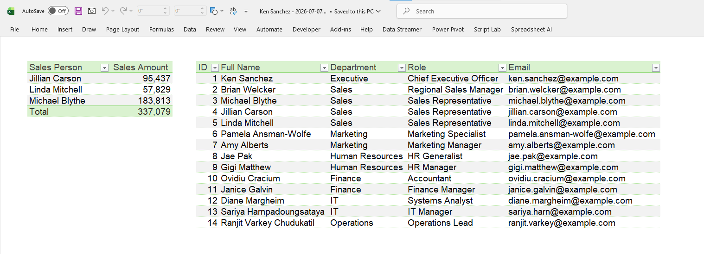
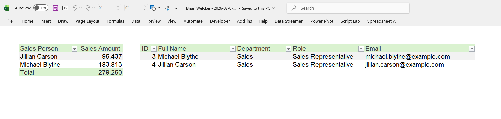

# Row-level Excel report distributor (xlwings)

Take one Excel report built on a Power Pivot data model and hand every person a copy that contains only the rows they are allowed to see: their own sales, their own row in the employee table. Then mail it to their Outlook or drop it in their OneDrive folder, unattended, on a schedule.

---

Under the hood this drives the real Excel desktop app over COM with [xlwings](https://www.xlwings.org/) ([docs](https://docs.xlwings.org/en/latest/)), the open-source Python package. It is BSD 3-Clause licensed and I use it as a normal dependency here with `uv sync`, not redistributing any of its code, so nothing about its license needs special handling for what this project does. On Windows xlwings also pulls in `pywin32`, which is what sends the Outlook mail.

If you have seen my two Power Query refresh orchestrators, this is built the same way on purpose (config, event log, engine, entry point), so if you know those you already know your way around this one.

> **Windows only, and Outlook for email.**
> The power pivot data model is a Windows-only Excel feature.
> The email step uses your signed-in **classic** Outlook desktop app over COM.
> The "new Outlook" has no COM automation, so on a new-Outlook machine, use the OneDrive delivery channel instead, which is just a file copy. Classic Outlook stays supported for a while yet (Microsoft has committed to at least October 2029)


## The problem this tool solves

You have a report: Power Query pulls the data, loads it into the data model, and the pivots are built on the model. Several people each need their own copy. A salesperson should see only their own numbers and their own employee row, a manager should see their people, and the CEO should see everything, and every copy still has to reach that person.

Done manually it is: refresh all, filter, save a copy, mail it, remove the filter, filter again for the next person, save, mail, and so on for everyone, every time the data changes. It is slow, it is repetitive, and it is exactly the kind of job that never happens overnight when you'd want it to.


## How it works, and why it is built this way

Four decisions do most of the work. Each one exists because the obvious shortcut is quietly wrong.

### The filter lives in Power Query, driven by a single cell

The master workbook has one named cell, `pAccessKey`, on a hidden `Control` sheet. Before generating each recipient's report, the tool writes that recipient's access key into the cell and refreshes the workbook.

The `Employees` and `Sales` queries read the cell (`Excel.CurrentWorkbook`), parse it, and filter both tables to the permitted `EmployeeID`s before loading the model. The access key is plain: blank means "see everything" (the CEO), one id (`3`) means one person, a comma list (`3,4`) means a manager who sees those people.

I drive this with a cell rather than a Power Query *parameter object* on purpose. A cell is trivial to write over COM (`range.value = key`); a parameter's current value is buried in the workbook's mashup and can't be set cleanly from code without rewriting the query. The cell approach also doesn't care whether there's a data model behind it, so the same mechanism works for any Power Query report.

### Each query is refreshed one at a time, not with Refresh All

When driven from code, `Workbook.RefreshAll` does not raise or report an error if a query fails. It kicks the refreshes off and returns, and a broken query fails silently. If you saved after that you could ship a wrongly-scoped file and record a success. So, exactly as in my refresh orchestrators, the tool walks the connections, sets `BackgroundQuery = False` on each (so the call blocks until that query is actually done), and refreshes each one inside its own try/except. It then refreshes the PivotTables so they reflect the reloaded model.

The internal Data Model connections, `ThisWorkbookDataModel` and any `ModelConnection_ExternalData_N`, are skipped, but not because the code checks their names. Every workbook connection exposes a `Type` from Excel's `XlConnectionType` enum, and the tool only treats a connection as refreshable if that type is `xlConnectionTypeOLEDB` (1) or `xlConnectionTypeODBC` (2), the two types that actually pull rows from an external source. The Data Model connections carry `xlConnectionTypeMODEL` (7), so neither bucket applies and the code correctly leaves them alone. The real refresh flows entirely through the individual Power Query connections.

### If a refresh fails, no copy is written

A half-filtered report is worse than none, and here "half-filtered" could mean leaking rows. So it is all-or-nothing: if any query fails for a recipient, that recipient's copy is **not** written, the failure is logged, and the batch moves on to the next person. You never get a silently mis-scoped file on disk.

### Delivery is off by default, and the preview is the trust gate

A wrong access key doesn't just produce an ugly report, it could email person A's data to person B. So the safe path is the default. Out of the box, delivery is **off**: the tool generates every copy into an output folder and sends nothing, so you read the preview of who-sees-what and open a few of the generated files first.

That check, not a confirmation on every send, is the gate. Once a config has proven itself you flip delivery on, and from then on email **sends** automatically on each run, with no manual step in the scheduled job. If you want one more look at the actual messages the first time, set the email mode to `draft` and it builds them in your Outlook Drafts folder, unsent, for you to review before switching back to `send`.

---

## Step by Step Instructions

### Step 1: Get to know the CSV files

#### Sales and Employees

These files are meant to represent a real-world fact table and dimension table. The `Employees` table (the dimension) holds 14 rows, one per employee, with their role and email address. The `Sales` table (the fact table) holds 100 rows, the sales made by the 3 sales representatives.

#### The recipients list

This is the tool's control input, and it never goes to a recipient: it holds everyone's access keys and addresses, so it stays with us. CSV or `.xlsx`, header row required, columns in any order:

| Column           | Meaning                                                                                                                                                                                                             |
| ---------------- | ------------------------------------------------------------------------------------------------------------------------------------------------------------------------------------------------------------- |
| `RecipientName`  | Names the output file and fills the `{name}` placeholder in the email.                                                                                                                                              |
| `AccessKey`      | Comma-separated `EmployeeID`s this person may see. **Blank = everything.** `3` = one person. `3,4` = a manager who sees those people.                                                                               |
| `Email`          | Outlook address. Blank to skip emailing this person.                                                                                                                                                                |
| `OneDriveFolder` | Folder to copy the file into (OneDrive then syncs it). Blank to skip. See [Setting up OneDrive delivery](#setting-up-onedrive-delivery-what-goes-in-onedrivefolder) at the end of this README for what to put here. |
| `Enabled`        | `TRUE`/`FALSE` (default `TRUE`). `FALSE` keeps the row but skips it.                                                                                                                                                |

A manager's key is the ids of the people they oversee. To let a manager also see their **own** employee row, add their own id to the list (`2,3,4` instead of `3,4`). The whole list is one row per recipient: one row, one file, one email. That's why a manager's several ids live together in one comma-separated cell rather than spread across rows.

### Step 2: Build the master workbook

The master is the one file that holds the queries, the data model, and the pivots. We need to create this first before anything else.
Open **[MASTER-WORKBOOK-SETUP.md](MASTER-WORKBOOK-SETUP.md)** and after you've done all the steps in that file, come back to continue the steps here.

### Step 3: Prepare the virtual environment

Open the project folder, copy its path from the address bar, then in PowerShell:

```powershell
cd C:\Tools\rls-report-distributor
powershell -ExecutionPolicy Bypass -File setup.ps1
```

This installs **uv** if you don't have it, then creates a private environment inside the project and installs the one dependency. It uses a Python you already have (3.14+) and only downloads an isolated copy if you don't.

### Step 4: Edit `config.toml`

If you have followed `MASTER-WORKBOOK-SETUP.md` and named the folders and files exactly as suggested, there is no need to edit `config.toml`. Otherwise, make sure the paths below match what you actually created.

```toml
[paths]
master_workbook = 'C:\Tools\rls-report-distributor\master-reports\Sales-RLS-Master.xlsx'
output_dir      = 'D:\rls-reports\out'
log_dir         = 'D:\rls-reports\logs'

[recipients]
path = 'C:\Tools\rls-report-distributor\sample-data\sales-recipients.csv'
```

### Step 5: Dry run, and read the preview

Run the following command in a new PowerShell window in the project directory:

```powershell
uv run python distribute_reports.py
```

It first prints every recipient and the ids they resolve to, so you can catch a wrong or missing access key **before** anything is generated:

```
Recipients and their resolved scope:
  Recipient               Sees IDs              Delivery
  ------------------------------------------------------------------
  Ken Sanchez             ALL (unrestricted)    generate only
  Brian Welcker           3,4                   generate only
  Michael Blythe          3                     generate only
  ...
```

Then it generates a copy per recipient into `output_dir` and delivers nothing.

Each file is named `<Recipient> - <date>.xlsx` (for example, `Michael Blythe - 2026-07-05.xlsx`). The date is today's date, the same one for every recipient in the run, so re-running the tool the next day writes a new set of files instead of overwriting yesterday's.

Here are three of the five generated reports, so you know what to expect. The first is for the CEO, Ken Sanchez, who has access to all the data.



The second is for Brian Welcker, the regional sales manager, who supervises employees 3 and 4.



The third is for Linda Mitchell, a sales representative with employee ID 5.


### Step 6: Turn on delivery

#### Outlook
Once the preview and the generated files look right, flip the master switch in `config.toml`:

```toml
[delivery]
enabled = true          # master switch; email now sends on each run

[delivery.email]
enabled = true
mode    = 'send'        # sends immediately; use 'draft' for one more review pass
```

Run it again and each report is emailed to its recipient. If you'd rather inspect the actual outgoing messages the first time, set `mode = 'draft'` for a run: the emails land in your Outlook Drafts folder with the report attached, unsent, and you switch back to `'send'` once they look right. 

#### OneDrive
For OneDrive, set `[delivery.onedrive].enabled = true` and put each person's folder path in the `OneDriveFolder` column of the recipients list.


OneDrive delivery is a plain file copy, not an API call. The tool copies each recipient's report into a local folder, and it is OneDrive's own desktop sync client, already running on the machine that runs the distributor, that notices the new file and uploads it from there.

That means `OneDriveFolder` has to be a path OneDrive is actually syncing on the machine the tool runs on, not a cloud URL. 
The normal shape is a subfolder inside a library the recipient already has access to: a folder shared with them inside your own OneDrive, or a folder in a SharePoint document library that is synced locally on this machine, something like:

```
C:\Users\<you>\OneDrive - <org>\Reports\Michael Blythe
```

### Step 7: Schedule it

Open **Task Scheduler**, choose **Create Task** (not "Basic Task"):

1. **General tab:**
Name the task and make sure **"Run only when the user is logged on."** is selected. This is essential, Excel automation needs a real desktop. "Run whether logged on or not" runs with no desktop and Excel will fail.
2. **Triggers tab → New:**
Daily or Weekly and a start time.
3. **Actions tab → New:**
Action = *Start a program*.
Program/script = the full path to **`run-distribute.cmd`**.

**The PC must be on and this user logged in at that time.** Excel automation can't run on a locked-out or logged-off session.
